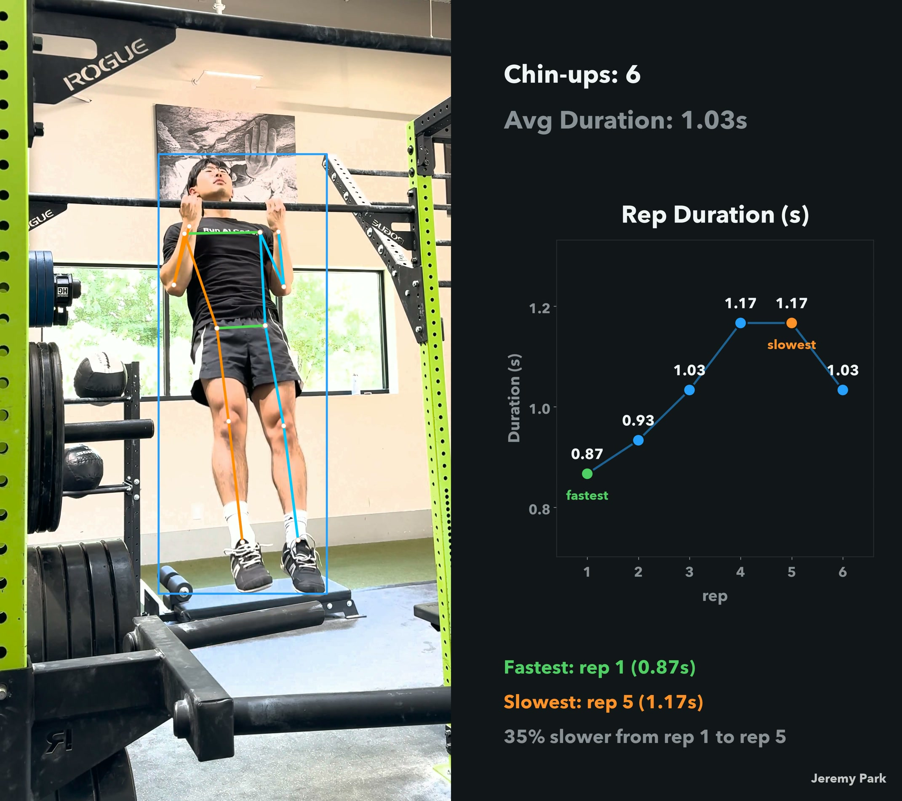
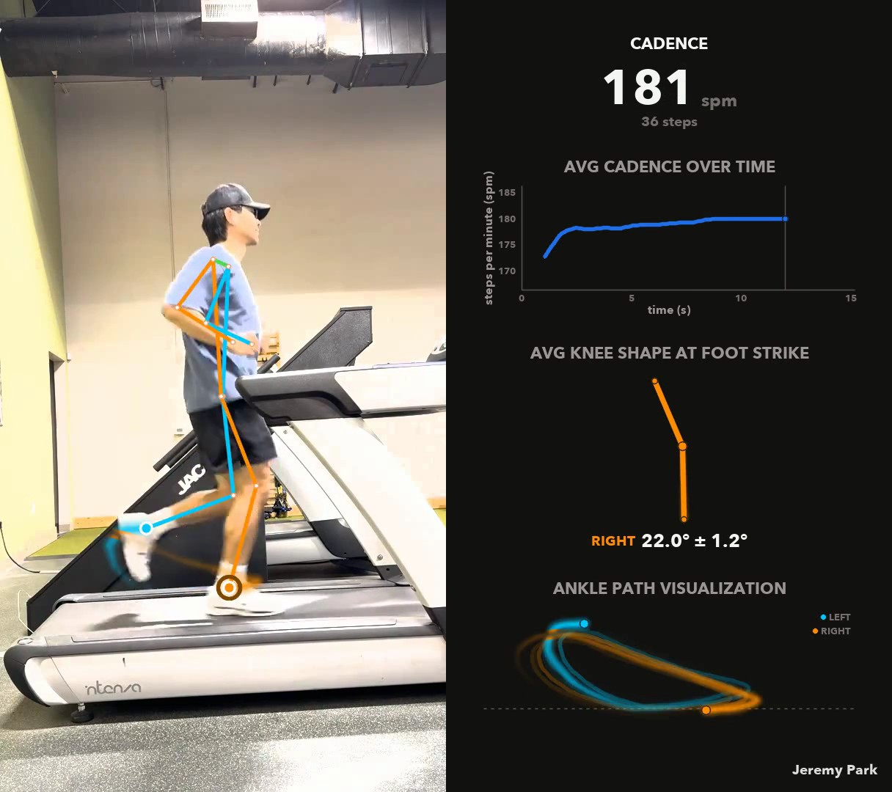

# vision-demos

Real-world computer vision demos.

| Project | What it does | Key model |
|---|---|---|
| **[dance_sync](dance_sync/)** | Compares dancers' sync performing the same choreography and computes a similarity metric. | [`vitpose-plus-large`](https://docs.vlm.run/gateway/models/usyd-community-vitpose-plus-large) |
| **[chin_ups](chin_ups/)** | Counts chin-up reps from a clip and times the ascent and descent of each one. | [`vitpose-plus-large`](https://docs.vlm.run/gateway/models/usyd-community-vitpose-plus-large) |
| **[running](running/)** | Measures a runner's cadence, times every foot strike, and averages the knee shape at contact. | [`vitpose-plus-large`](https://docs.vlm.run/gateway/models/usyd-community-vitpose-plus-large) |

Each project has its own README with setup and instructions.

## License

[Apache-2.0](LICENSE).
