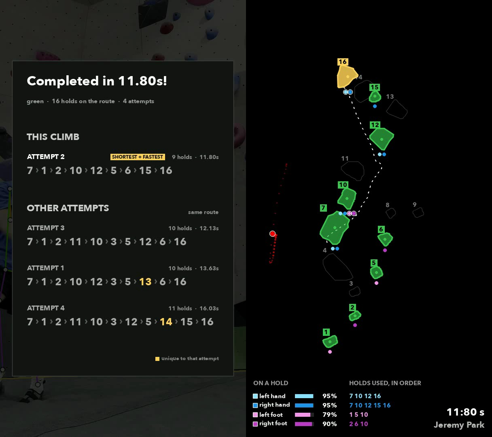

# rock_climbing

Segments a boulder problem off the wall, follows the climber up it, and reads the
route back: which holds were used, in what order, and how long the send took.
Point it at several attempts at the same route and each render ends on a card
comparing their sequences. Two models run on the
[VLM Run Gateway](https://www.vlm.run/gateway):
[`sam3.1`](https://docs.vlm.run/gateway/models/facebook-sam3.1) for the holds and
the floor,
[`vitpose-plus-large`](https://docs.vlm.run/gateway/models/usyd-community-vitpose-plus-large)
for the climber. There are no weights to download.

For how the route is read and the attempts are aligned, see
[route-reading-explained.md](route-reading-explained.md).



## Run it

1. **Get an API key** at [app.vlm.run/sign-in](https://app.vlm.run/sign-in).

2. **Set it** in a `.env` at the repo root:

   ```bash
   cp ../.env.example ../.env
   # paste your key after VLMRUN_API_KEY=
   ```

3. **Create the conda environment:**

   ```bash
   conda env create -f environment.yml
   conda activate rock_climbing
   ```

4. **Add your clips** under `data/input/current/`: one or more attempts at the
   same route, filmed from the same camera position.

5. **Run it** from this directory:

   ```bash
   python main.py
   ```

Every clip in `data/input/current/` is read as another attempt at the same route.
Drop one in and it behaves like a single run; drop four in and each render ends
on a card comparing its holds against the other three. Set `BATCH_MODE = False`
to run one clip, named by `INPUT_VIDEO`.

Film the whole wall from a tripod. Holds are detected once per clip and reused
for every frame of it, and in batch mode the clips are compared to each other
hold for hold, so the camera should not move within a take or between takes.

## The route is the prompt

```python
HOLD_COLOR = "green"                     # config.py
HOLD_PROMPT = "{color} climbing hold"
ROUTE_GRADE = "VB"                       # metadata; recorded, not drawn
```

Point it at another colour and the demo follows a different problem up the same
wall, with no retraining and no new model. That is what SAM 3.1 buys over a
detector fine-tuned on one gym's holds.

Every other knob lives in [`config.py`](config.py), and each run snapshots the
ones it used into `run.json`.

## Output

In batch mode, one timestamped directory holding a subdirectory per clip:

```
20260915-153000/
├── comparison.json      # every attempt, aligned onto one numbering
├── sequences.txt        # the same thing, human-readable
├── IMG_8842/            # everything below, per clip
└── …
```

Otherwise one timestamped directory per run under `data/output/`:

```
20260914-231204/
├── climbing_climb.mp4   # the pair, side by side, with the original audio
├── climbing_route.mp4   # the right panel alone
├── holds.png            # the detected route on a clean frame; check this first
├── climb.json           # order, timings, per-hold contact, utilization
├── hold_times.csv       # one row per hold: order, limbs, timings
├── limb_usage.csv       # one row per (limb, hold): seconds and share
├── summary.txt          # the climb, human-readable
├── sequence.json        # the sequence, the moves, and the other attempts
├── holds.json           # every hold's mask polygon and bbox, normalized
├── poses.json           # the raw gateway response
├── metrics.txt          # throughput and cost, with metrics.json beside it
└── run.json             # config + provenance
```

Converted MP4s, segmentation results and pose responses are cached in
`data/cache/`, keyed on the source file *and* the settings that shaped them, so a
changed prompt never reuses a stale route. Both directories are gitignored.

If a run comes out wrong, look at `holds.png` first: nearly everything
downstream is a consequence of it. The knob for each symptom is in
[route-reading-explained.md](route-reading-explained.md).

## License

[Apache-2.0](../LICENSE).
